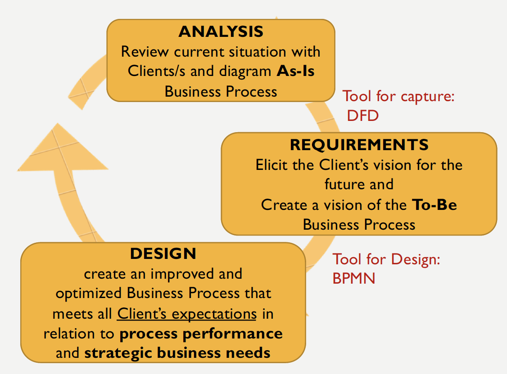
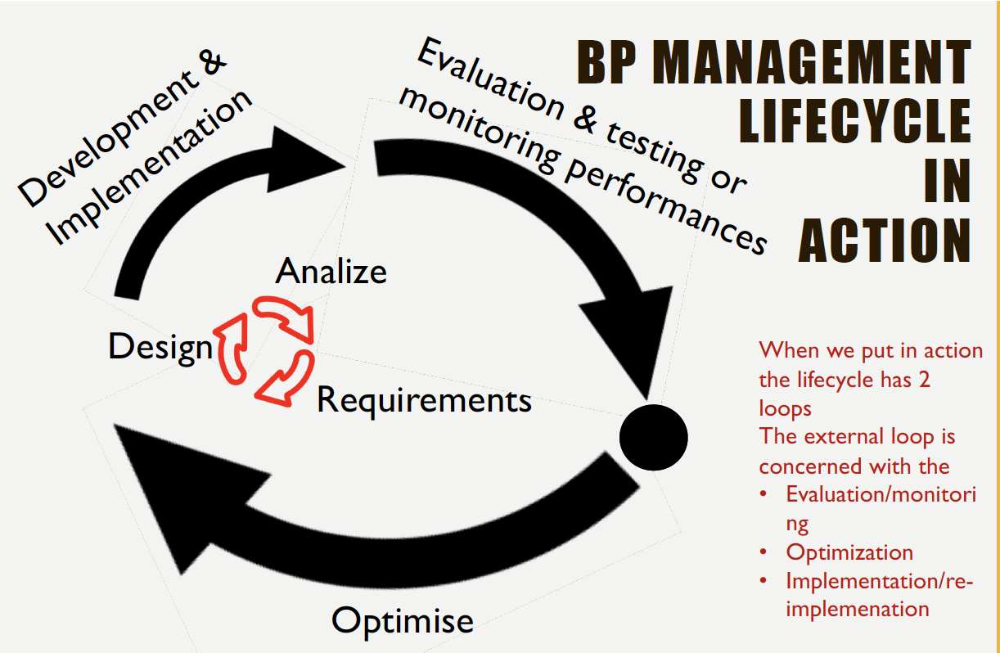
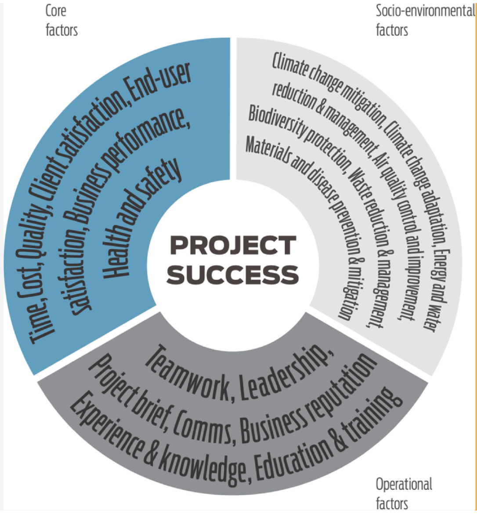
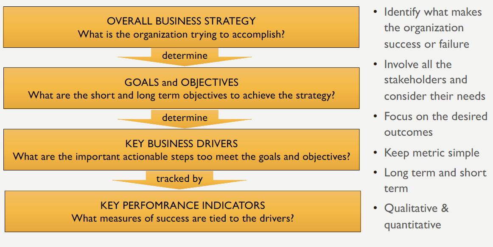

# Lecture 2: Process Modelling and Management - 07/10/19

## Learning Outcomes:

- Explain the purpose of Business Process Management (BPM)
- List the advantages of BPM
- Describe the change management lifecycle using BPM
- The use Business Process Modelling Notation (BPMN) to illustrate business processes

## Business Process

> A business process:
>
> - Describes the actions to be taken to accomplish a task
> - A collection of linked tasks which find their end in the delivery of a service or a product to a client
> - A set of activities and tasks that, once completed, will accomplish the organisation goal

***Note that***

A ***process*** in this context is not to be confused with:

> A process (computing) is an instance of a computer programme being executed

## Business Process Management (BPM)

> Business Process Management is a field in opertaions management that focuses on improving corporate performance by managing and opyimising a company's business processes.

## Business Process Modeling (BPM)

> Business Process Modeling in systems engineering is the activity of representing processes of an enterprise, so that the current process may be analysed or improved.

## Advantages of BPM

- Enabling fast information transfer
- Enabling quick decision making
- Enabling adapts to changing demands
- Increasing competitiveness
- Decreasing cycle time
- Bridges the world of business and IT
- Increased visibility of a company’s activities.
-  Increased ability to be able to be able to identify bottlenecks.
- Increased identification of potential areas of optimisation.
- Reduced lead times.
- Better definition of duties and roles in company.
- Good tool for fraud prevention, auditing and assessment of regulation compliance.

### Operational Benefits:

- High-performance processes, which operate with much lower costs, faster speeds, greater accuracy, reduced assets, and enhanced flexibilit
- By focusing on and designing end-to-end processes that transcend organizational boundaries, companies can drive out the nonvalue adding overhead that accumulates at these boundaries.
- Through process management, an enterprise can assure that its processes deliver on their promise and operate consistently at the level of which they are capable.
- Through process management, an enterprise can determine when a process no longer meets its needs and those of its customers and so needs to be replaced.

### Strategic Benefits:

-   Process management enables companies to respond better to periods of rapid change (such as ours).
    -   Time lag
    -   No mechanism even if the organisation recognises it
-   Provides an umbrella for a wide range of other performance improvement initiatives, from globalization and merger integration to ERP implementation and e-business.
    -   Too many enterprises treat each of these phenomena as independent, which leads to a proliferation of uncoordinated and conflicting change initiatives.
    -   Linking all of a company’s improvement efforts under the common umbrella of process management, and managing them in an integrated fashion, leverages a wide range of tools and deploys the right tool to the right problem.

## BMP Life Cycle

Many information systems projects are conceived in a life cycle that progresses in stages from Analysis to Implementation.

### Analysis

-   Document the business goal/s
-   Clarify the problem/s being addressed
-   Assess the ***as-is*** or current state, of the enterprise in detail
-   Develop an initial vision for the BPM solution

### Requirements

-   Elicit the client’s vision for the business processes
-   Analyse the the needs of the client and end-users
-   Identify Critical Success Factors  (CSF) and Key Performance Indicators (KPI) of the business goals

### Design

-   Draft a vision of the ***to-be*** business processes or future steady state, enterprise business processes
-   Simulate the processes and <u>assess the critical factors</u> utilising the key performance indicators (and in case re-design)

### Development & Implementation

-   Processes & IT architecture are modelled, built, integrated, assembled, deployed into the business, and monitored

### Evaluation & testing, monitoring

-   Evaluate if client and users and business expectations are met

### Optimise

-   Optimised for better performance and to meet the business and IT metrics used to define the success of the enterprise operations.

## Key Performance Indicators (KPI)

>   A quantifiable measure used to evaluate the success of business in meeting the performance objectives.

>a set of quantifiable measures that a company use to compare performances in terms of meeting the strategic and operational goals

To evaluate actual process performance, it is important to have a clear and shared understanding of both:

-   Process Outputs (deliverables) and related
-   Key Performance Indicators (KPIs)

KPIs provides a valuable source for the translation of strategic objectives to process-specific goals and facilitates effective process control.

KPIs can differ in their nature, including financial, quantitative, qualitative, or time-based data, and will be dependent on the strategic.

As far as possible, such KPIs should be standardized across the various processes and in particular across the different process variants (e.g., in different countries)

## Project Sucess Factors (PSF) and Critical Success Factors (CSF)

CSFs are a way to prioritize certain tasks as the project plan is being executed.

-   ***Core*** – fundamental principles for the industry and its projects
  
-   (e.g. client satisfaction, business performance and health and safety)
  
-   ***Operational*** – the effect that the behaviour of people working on a project can have on its development

    -   (e.g. teamwork, communication, experience and knowledge)

-   ***Socio-environmental*** – the sustainability of the project during its lifespan

    -   ( e.g. energy and water reduction, waste reduction, climate change

    mitigation)

## Enablers of Process

There are five critical enablers for a high-performance process; without them, a process will be unable to operate on a sustained basis:

-   ***Process desgin***: This is the specification of the task to be performed (when, by whom, where, circumstances, precision, information, etc.)
-   ***Process metrics***: These are derived by the customers needs and the goals of the enterprise. They are set as targets (objectives/goals) and per performance to monitor them (KPI)
    -   *Example*: Enterprise goal: Fastest delivery company => KPI: time taken from order to delivery
-   ***Process performers***: These are the people that make the process happen, they understand the overall process and its goals, can work in teams, and manage themselves
-   ***Process infranstrcutures***: The performers need to be supported by the IT and HR department and systems to be able to perform their process
-   ***Process owners***: Senior Managers with the authority and the responsibility for one or more process, they are the one that review the process performances

## KPI and Key Business Goals

## Business Process Model and Notation (BPMN)

> Business Process Model and Notation is a graphical representation for specifying business process in business process model.

A standard created by the ***OMG***:  The **Object Management Group** (**OMG**), which is an international, open membership, not-for-profit technology standard consortium 
