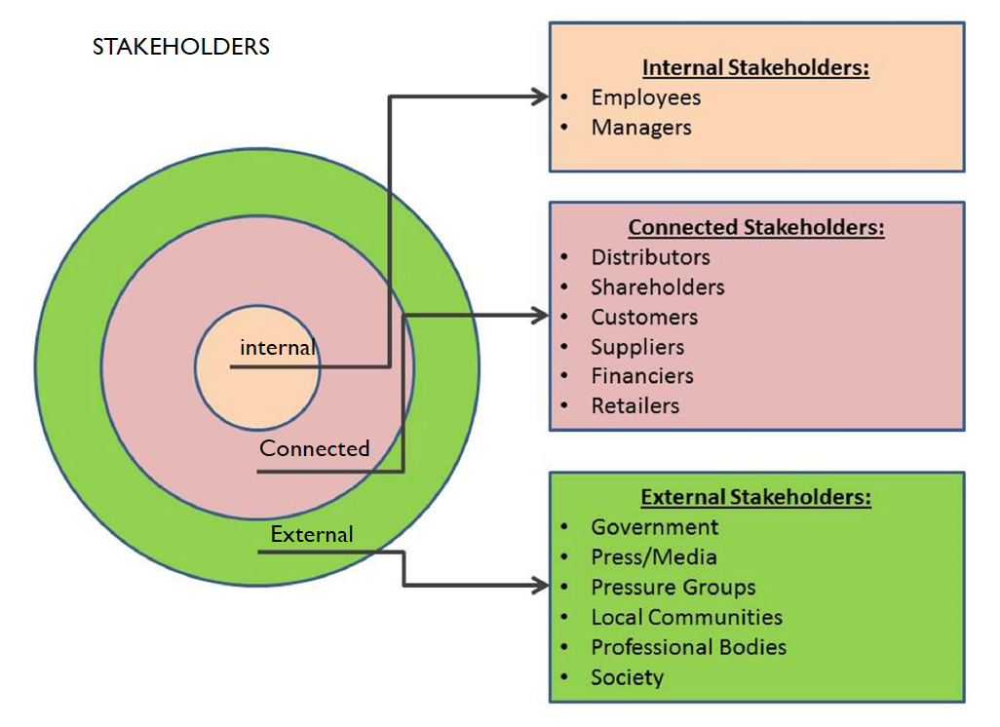
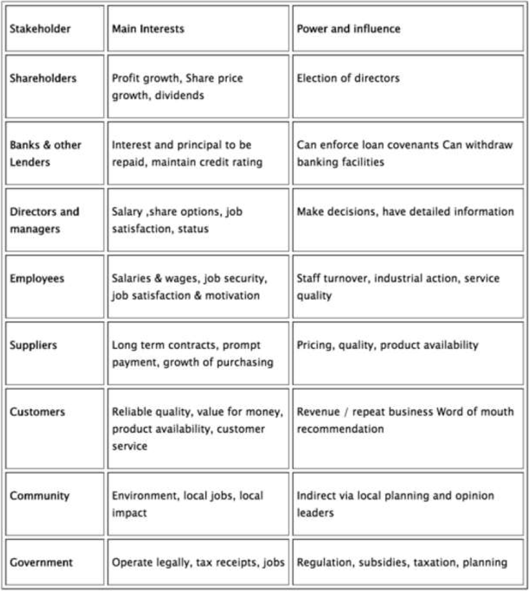
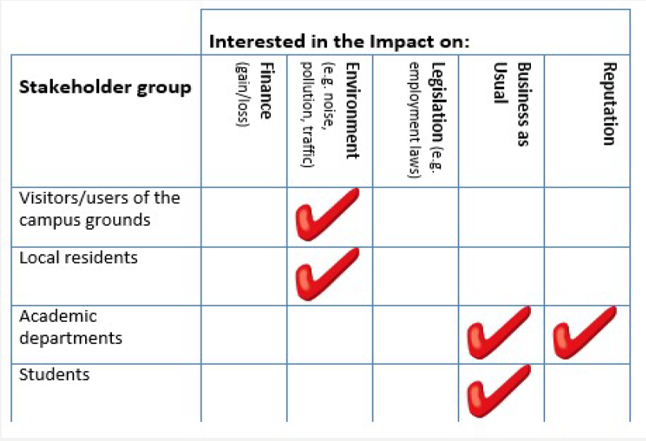
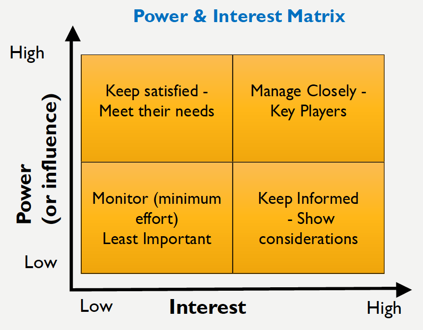
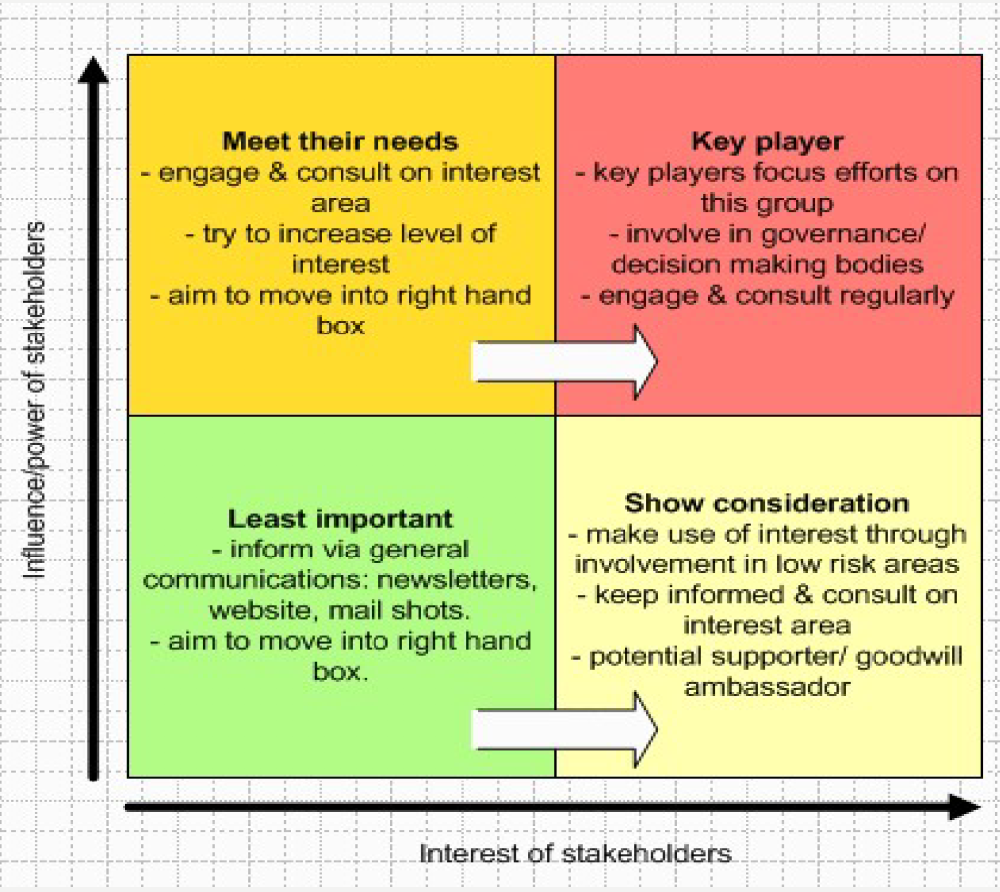
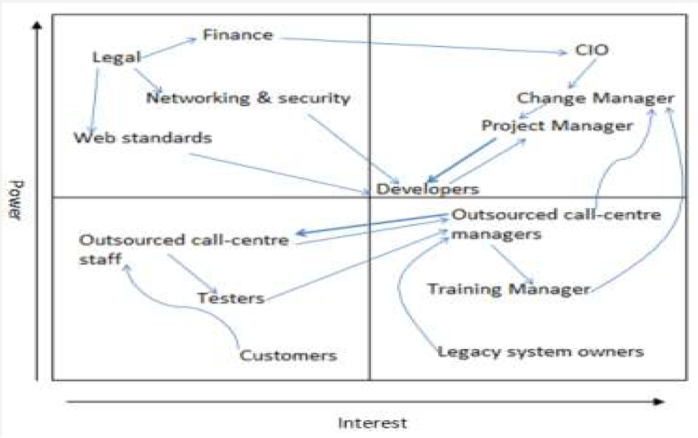
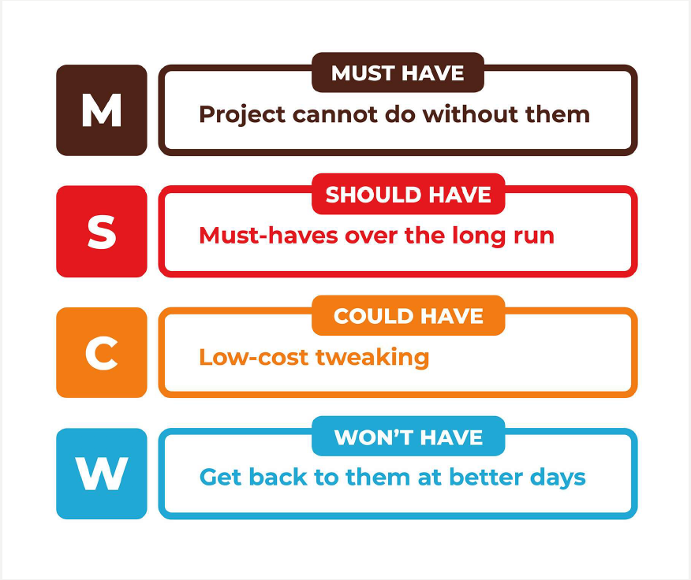
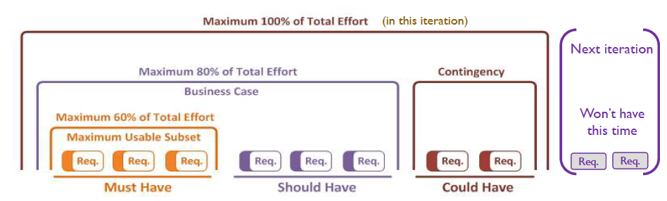

# Lecture 3: Stakeholders Analysis and MoSCoW Requirement - 14/10/19

## Learning Outcomes

-   Stakeholders analysis
-   MoScoW requirements

## Stakeholders

>   Any individual or group that can affect or are affected by the achievements of the business objectives

Stakeholder groups vary both in terms of their ***interest*** in the business activities and also their ***power*** to influence business decisions

## Types of Stakeholders

-   ***Internal stakeholders***: \- are entities within a business, member of the organization
    -   e.g. Staff Management, Finance, Facilities management, Compliance, employees, managers, the board of directors
-   ***Connected stakeholders***: also known as ***primary stakeholders***, are those that have an economic or contractual relationship with the organisation 
    -   e.g. company shareholders, distributors, customers, suppliers, competitors
-   ***External Stakeholders***: are entities not within the business itself, but who care about or are affected by its performance
    -   e.g. governments, regulators, interest and pressure groups, media and news organizations, local communities

## Why analyse the stakeholders?

-   ou need to identify all the individuals (or groups) who should be engaged with your system
-   Communicating and engaging with everyone in these grouping is vital, if you system is to be successful, as the stakeholders need to to understand and agree (buy-in) the business processes improvements
-   This is true whether you are creating a completely new system or if you are re-engineering a new system.
-   Analyzing the stakeholders will also allow you to discover elements and processes that you might have missed, identify requirements, Key performance indicators, etc.

## Stakeholders Analysis

### General steps

1.  Identify who your stakeholders are

2.  Work out their power, influence and interest, so that you know who you should focus on

3.  Group them

4.  Develop a good understanding of the most important stakeholders, so that you know
    -   What are their requirements
    -   How they are likely to respond
    -   How you can win their support

### Outcome of Stakeholders Analysis

-   Know what the stakeholders requirements are and derive the business & systems requirements
-   Identify the key performance indicators that will allow you to fulfil the requirements
-   Re-engineering the process to ensure the correct process are in place to fulfill the requirements

### STEP 1: Identify Stakeholders

Start by brainstorming on who your stakeholders are:

-   Think of all the people who are affected by your process 
-   Who has influence or power over it
-   Who has an interest in its successful or unsuccessful conclusion

Stakeholders can be both organizations and people, but ultimately you must communicate with people. So, be sure to identify the correct individual stakeholders within a stakeholder organization

### STEP 2: Group Them

Organise your stakeholders into clearly identifiable groups of people with similar interests.

### STEP 3: Prioritise Stakeholders

Map out your stakeholders, and classify them according to their power over your work and their interest in it, on a ***Power/Interest Grid***

>   ***Power/Interest Grid***: A common approach is to map the interest and power or influence of each stakeholder group on a quadrant

Once stakeholders are mapped onto the grid it will quickly become apparent where effort should be  expended in engaging and influencing.

 The position that you allocate to a stakeholder on the grid shows you the actions you need to take with them:

-   ***High power, highly interested people*** - **Manage Closely**: you must fully engage these people, and make the greatest efforts to satisfy them.
-   ***High power, less interested people***  - **Keep Satisfied**: put enough work in with these people to keep them satisfied, but not so much that they become bored with your message.
-   ***Low power, highly interested people*** - **Keep Informed**: adequately inform these people, and talk to them to ensure that no major issues are arising. People in this category can often be very helpful with the detail of your project.
-   ***Low power, less interested people*** - **Monitor**: again, monitor these people, but don’t bore them with excessive communication.

>   ***The goal***: to influence stakeholders so that their view of the project can be more positive or their impact on the project can be reduced or increased.

### STEP 4: Map the Influence Lines

1.  Organise the stakeholders into the Power and Interest matrix

2.  Review the matrix and think about *who influences whom*

3.  Draw lines between stakeholders to illustrate **the influences between them** (the lines can be in two directions, but you should try to identify the strongest direction of the influence)

4.  To illustrate the **stronger influence** lines by using **wider or darker lines**.

You will have clear indication of who are the most influential or central stakeholders. Adding influence lines reveals the importance of stakeholders & the lines of communication between stakeholders predicting the path potential issues will follow.

Once the lines are complete you will have clear indication of **who are the most influential** or **central stakeholders**. Adding influence lines reveals the **importance** of stakeholders & the lines of communication between stakeholders predicting the path potential issues will follow.

### STEP 5: Understand Key Stakeholders

Questions to ask that help you understand your ket stakeholders and their requirements:

-   What financial or emotional interest do they have in the outcome of your work? Is it positive or negative?
-   What motivates them most of all?
-   What information do they want from you, and what is the best way of communicating with them?
-   What is their current opinion of your work? Is it based on good information?
-   Who influences their opinions generally, and who influences their opinion of you? Do some of these influencers therefore become important stakeholders in their own right?
-   If they aren’t likely to be positive, what will win them around to support your project?
-   If you don't think that you’ll be able to win them around, how will you manage their opposition?
-   Who else might be influenced by their opinions? Do these people become stakeholders in their own right?

### STEP 5: Gather Stakeholders Requirements

You can ask your stakeholders questions directly. People are often quite open about their views, and asking for their opinions is often the first step in building a successful relationship with them.

A simple way to summarize the level of backing you have from yourstakeholders is to color code them. For example:

***GREEN*** - supporters in green

***RED*** - blockers and critics

***WHITE*** - neutral

## 80/20 Prioritisation Rule

80/20 prioritization rule is the key reason why system of prioritization works. 

>   80% of typical activities contribute something like 20% to the value of our work. That is 80% of the project’s benefits come from 20% of the time spent by its staff
>
>   ***"When you do only the most important 20% of your tasks, you get most of the value."***

**How can we define what tasks must be included in this 20%?**

One of the most essentials parts of any project in software development is requirement prioritization

## MoSCoW Requirement Prioritisation Technique

This is a technique prioritise what the system requirements. 

### Reason for Prioritisation

Requirements need to be prioritised because we can not always implement everything stakeholders want at once. Because the improvements on the system have a limited time and budget, prioritisation allows to set deadlines, evaluate costs of improvements, and fix stakeholders expectations.

### "<u>M</u>ust Have"

These requirements provide the ***Minimum Usable SubseT (MUST)*** of requirements which the project guarantees to deliver.

How do we know how to choose the MUST HAVE?

-   No point in delivering on target date without this; if it were not delivered, there would be no point deploying the solution on the intended date
-   Not legal without it
-   Unsafe without it
-   Cannot deliver a viable solution without it

Ask the question ***"What happens if this requirement is not met?"***

If the answer is ‘cancel the project – there is no point in implementing a solution that does not meet this requirement’, then it is a Must Have requirement

### "<u>S</u>hould Have"

Should Have requirements are defined as:

-   Important but not vital
-   May be painful to leave out, but the solution is still viable
-   May need some kind of adjustment (e.g. management of expectations, some inefficiency, an existing solution, paperwork etc.)

One way of differentiating a Should Have requirement from a Could Have is by reviewing the degree of ***”pain”*** caused by the requirement not being met, measured in terms of **business value** or **numbers of people affected**.

### "<u>C</u>ould Have"

Could Have requirements are defined as:

-   Wanted, or desirable, but less important
-   Less impact if left out (compared with a Should Have)

These are the requirements that are elicited as contingency.

When a problem occurs and the deadline is at risk, one or more of the Could Have's provide the **first choice of what is to be dropped** from this timeframe.

### "<u>W</u>on't Have This Time"

-   These are requirements which the project team has agreed **will not be delivered in this iteration**
-   They are recorded in the `Prioritised Requirements List` if they help clarify the **scope of the project**, as this avoids them being informally reintroduced at a later date
-   It helps to manage expectations that some requirements will simply not make it into the Deployed Solution, at least not this time around
-   Won’t Have's can be very powerful in keeping the focus on **what is and what is not in the scope if the project**

### Evaluation of MoSCoW

#### Advantages

-   MoSCoW technique is based on expert opinion of the team
-   It is quick and easy to complete
-   The technique is good in defining the priorities of projects that are in progress

#### Disadvantages

-   MoSCoW rules can be subjective.
-   If there is no effective cooperation with business, this prioritization method may be inaccurate
-   The technique requires the team to have good familiarity with the product features (When the participants have different levels of familiarity with the product, it is difficult for them to classify or rank the items and their expert conclusions will be unhelpful)

