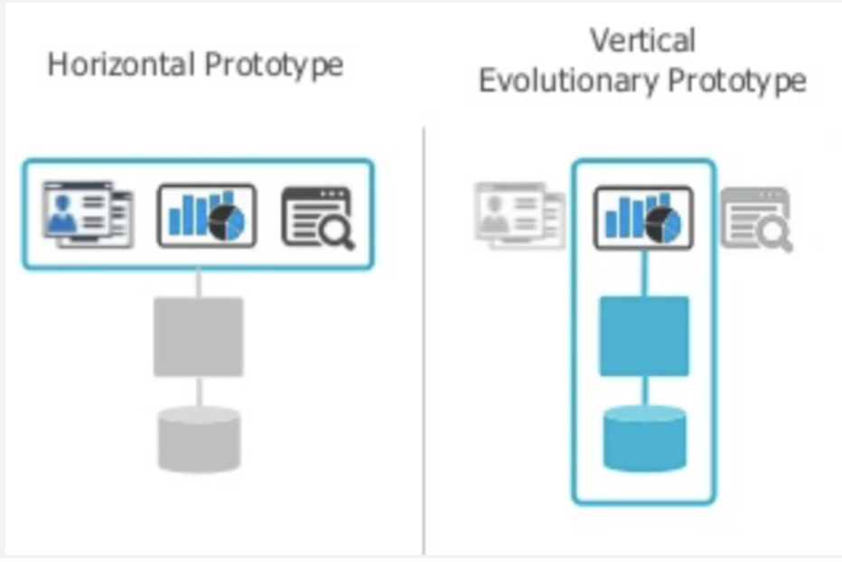
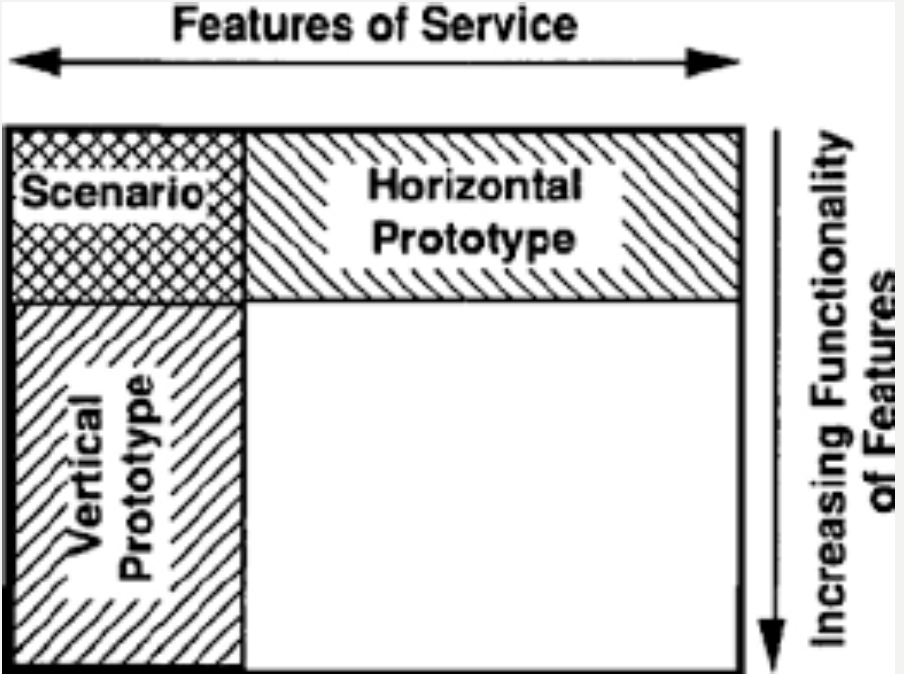
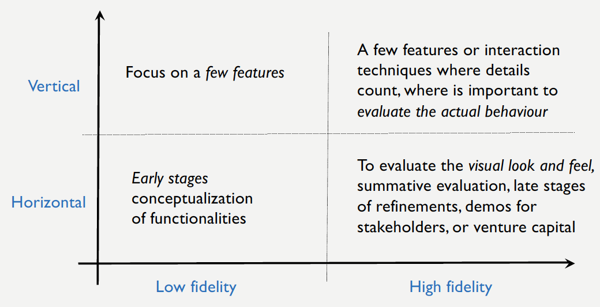
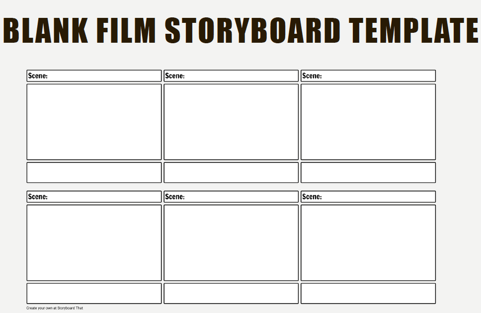
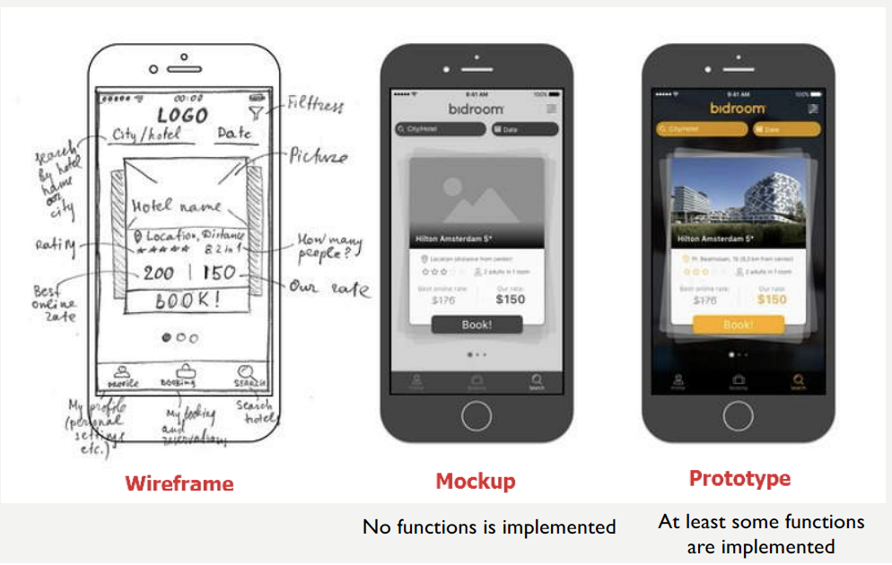

# Lecture 4: Requirement Gathering and Prototype - 21/10/19

## Learning Outcomes

-   Essential requirement gathering techniques
-   Types of prototypes

## Essential  Requirement Gathering Techiniques

-   Document Analysis
-   Reverse Engineering
-   Observations
-   Interface Analysis
-   Brainstorming
-   Focus Groups
-   Requirement Workshops
-   Interviewing
-   Prototyping
-   Survey

### Document Analysis

>   Evaluating the documentation of a present system can assist when documenting information system processes. 

It also helps determining the requirements that drove the making of an existing system. Information about the current systems are often buried their documentation. As such the documentation can assist you in answering the questions you might have as a part requirements validation

### Reverse Engineering

>   Reverse engineering consist in “taking apart” a system to see how it works. 

It involves determining what **a system/process does** and **build a comprehensive requirements profile**. It also involves considering the data generated and the business rules used to manipulate such data. (e.g. you might discover different ways of handling data that the system was not designed for)

Reverse engineering can be used at any time:

-   as last resort or

-   as a starting point for requirements gathering, or

-   to validate requirements

#### When to use reverse engineering?

-   If an existing project does not having enough documentation, or

-   The documentation is such that going trough it it would be a cumbersome tasks

### Observation

>   Conducting an observation means studying the users in their natural habitat. 

By watching users, process flow, pain points, awkward steps and opportunities for improvement can be determined by the analyst

Observation can either be ***passive*** or ***active***:

-   ***Passive Observation*** -  when the people being observed are not disrupted by the requirement gathering process (e.g. they are not aware of bring observed)

-   ***Active Observations*** - when the people being observed are aware of the person collecting the requirements (ethnography)

### Machine Interface Analysis

The interface for any software product will either be with a human ormachine (e.g. the integration with an external device or system is an interface). When we consider the human-machine interface we do User-centred design

>   Interface analysis considers the touch points (of the system under observation) with another external system

#### Why we do Machine Interface Analysis ?

As it helps not not overlook requirements that are not instantly visible tothe users as part of a process interface

### Brainstorming

>    Brainstorming is used to collect as many ideas as possible from a group of stakeholders in order to identify many different possibilities for the design of a system/business solution

The people brainstorming can be the developers, business analysts, the clients, or a combination of those groups.

### Focus Groups

>   A focus group is  a gathering of people who are representative of the users, or customers, in order to gain their feedback

The focus group highlights **opportunities, needs, and problems** with the current processes, and help **determine or refining the requirements, or validate existing requirements.**

#### Focus Groups vs. Brainstorming

The main difference from brainstorming is that a focus group is conducted with ***particular participants***

-   The sampling will depend on how the information will be used
-   The most common method for sampling is to select those members that you think will provide the best information (e.g. all people involved in a particular process to answer questions about that process)

### Requirement Workshop

>   A requirements workshop is also known as **joint application design**

A more modern name is ***hackathon*** where a problem is given to gain the participants

ideas and solutions. A workshop is best run with two analysts:

-   one acts as a facilitator

-   the other take notes of the joint design

#### Difference with other data gathering methods

-   Requirements workshops are more **organized and structured** than a brainstorming sessions where the involved parties get together to document requirements

-   Requirements workshops can include **particular groups** as in the focus groups, or **just gather volunteers**

### Interviews

Interviews are best used when specific questions need to be addressed. They are used when it is important to consider the perspective on the system/business of the:

-   system end-user, but also
-   any stakeholders

#### Listening is the most important skill in an interview

-   Listen carefully to the person being interviewed in order to **properly address and weigh their inputs**
-   The analysts should not **interfere** with the answer being given
-    It is best to interview in pairs, where
    -   one analyst **asks** the questions
    -   the other **takes** notes, or **records** the answers to be transcribed later

### Survey

>   Surveys ask specific questions to a wider audience than interviews

Survey often use both quantitative and qualitative questions (agree / disagree, or rate , or explain something)

Surveys are a good data collection method as they can be **quickly done** with many participants reaching the power needed to be **representative** of the sample being studied (e.g. power of sample) and being able to **generalise** the results

### Prototyping

>   Often people are not able to articulate a specific needs or discuss abstract concepts, a prototype helps them focus on the actual physical interaction and discover new requirements and need needs they **had not considered**.

-   Prototyping is very helpful at **gathering feedback** from the users of a system, that only trough a prototype is able to have the look and feel of the system
-   Prototypes make a very good tool to brainstorm with analysts, developers and users

## Prototypes

>   A prototype is a basic **working model,** **mock-up or a simple simulation** of the product which leads us to create a minimal viable product to final product and variations

The main reason for prototyping is to **validate the idea** and this is the step in converting an idea to a real product.

## Types of Prototypes: Horizontal vs Vertical

-   ***Horizontal Prototype*** - the **user interface** in the form of screenshots, demonstrating the **outer layer of the human interface only**, such as windows, menus, and screens. The prototype is used to clarify the **scope and requirements of the product**

-   ***Vertical Prototype*** - the **back end** of a product like a database generation **to test front end**. It used to improve database design, test key components at early stages or showcase a working model, though unfinished, to **check the key functions**

## Types of Prototypes: Fidelity

e.g. an enginerring high fidelity prototype could be a 3D printing of yhe part or product being created

## Types of Prototypes: Storyboard, Simulation or Video

-   ***Storyboard*** - describes a product in a form of a **story** and demonstrates a **typical order** in which information needs to be presented. It helps in determining **useable sequences** for **presenting information**
-   ***Simulation*** - is **digitally creating** of a physical product to **predict the performance** of the product in the real world
-   ***Video*** - is made using video just to show others the **idea** in a **graphical/visual format**

## Types of Prototypes: Rapid, Feasibility or Mock-up

-   ***Rapid Prototyping*** - is used to **quickly engineer** an **initial model** of a product using a 3D CAD when you want to produce something **in a short span**
-   ***Feasibility Prototyping*** - is usually developed to determine the **feasibility of various solutions**. It is applied to the **resolve technical risks** attached to the development in terms of **performance, compatibility of components etc**.
-   ***Mock-up*** - is a prototype with **no functionalities**, just to get **overall** **visual** of the product. It is an **unpolished** version of the product with **no active features.**

