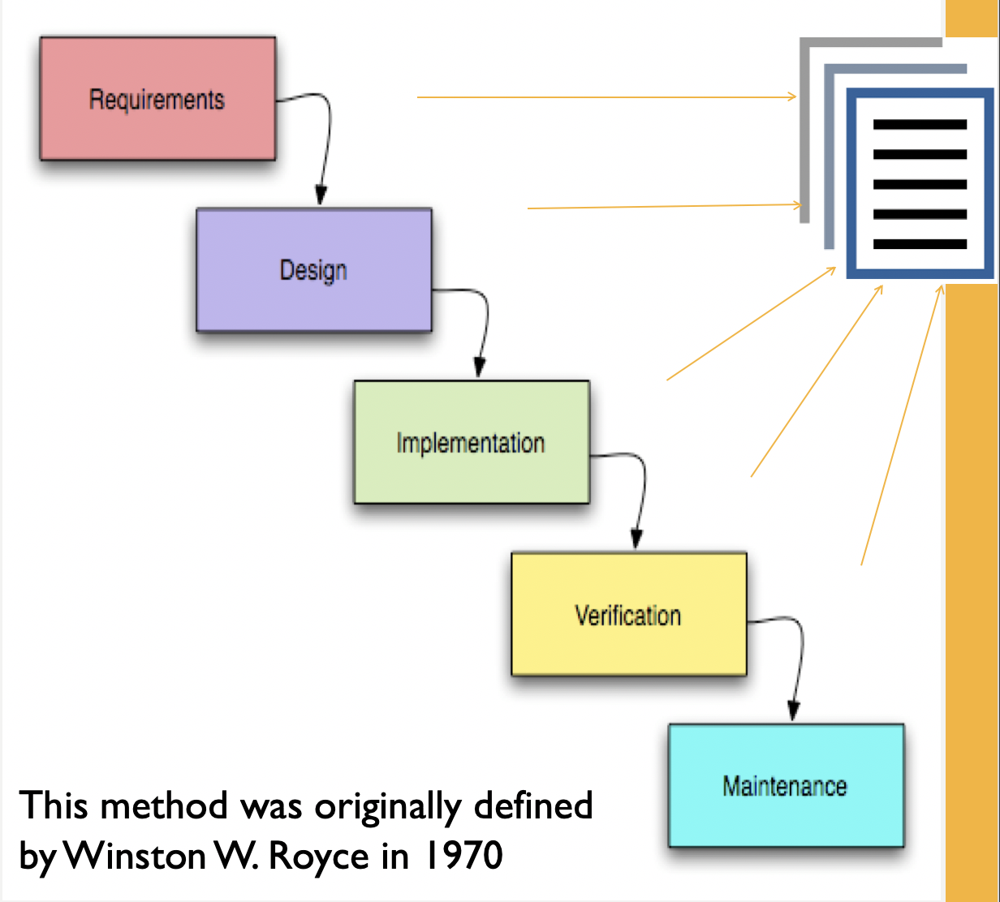
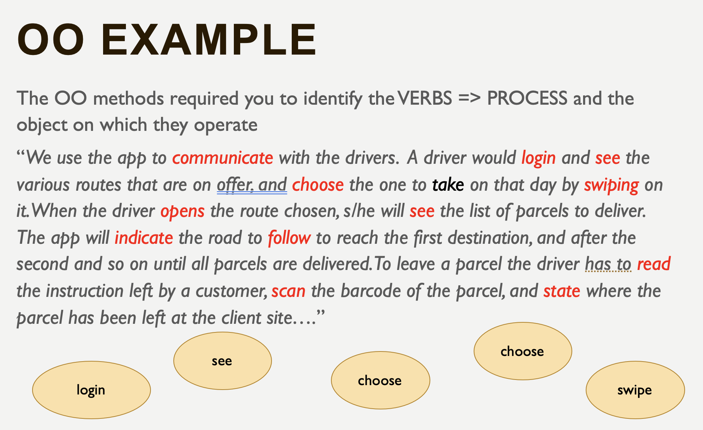
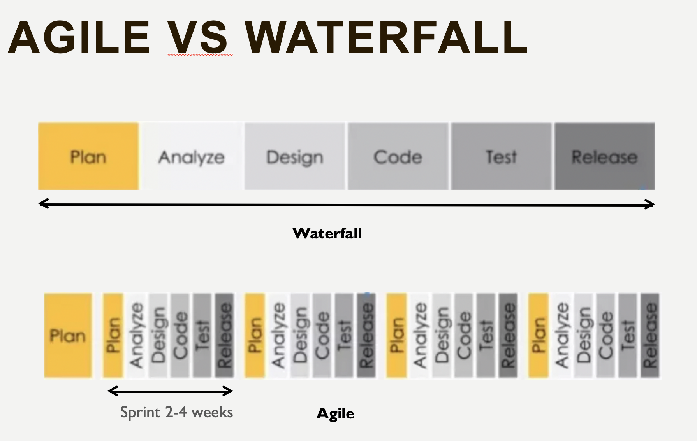
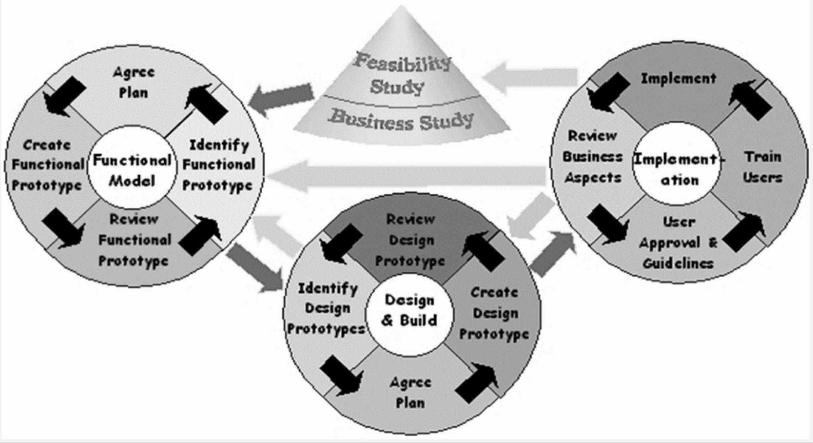
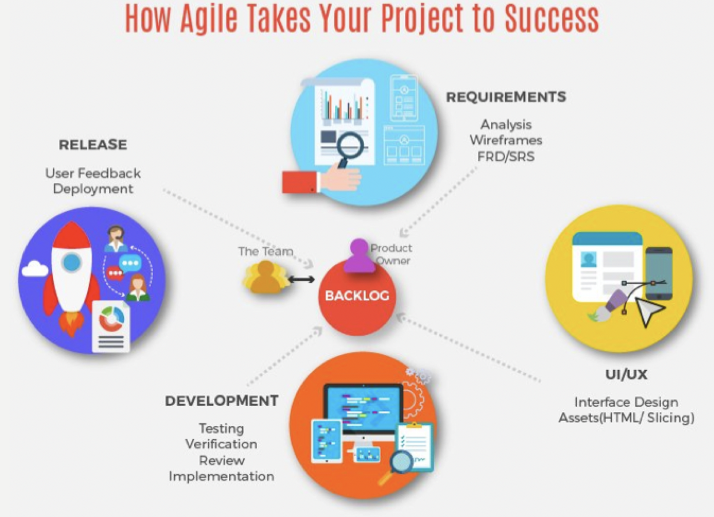
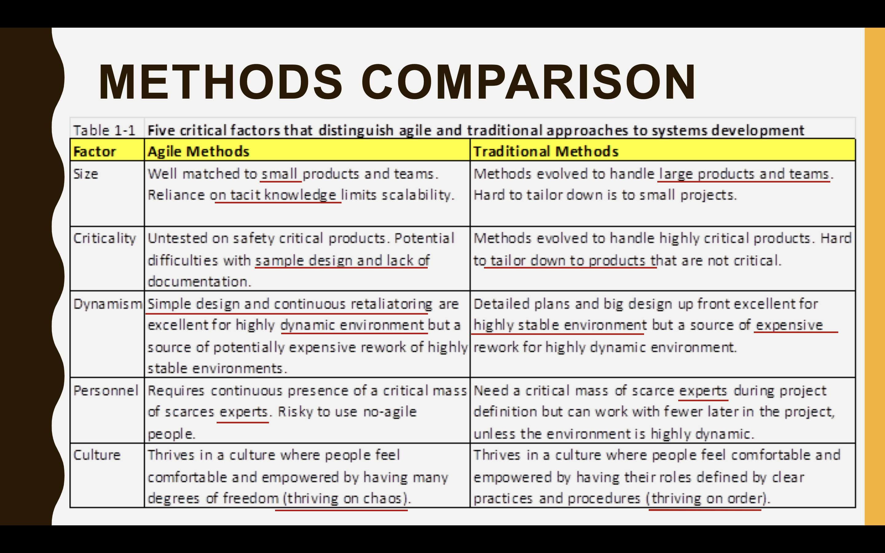
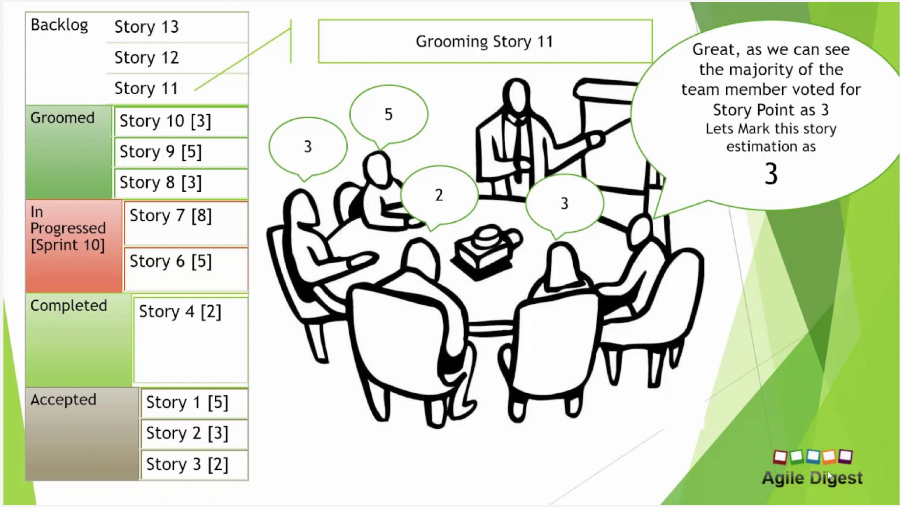

#  Lecture 7: Design Development & Methldolohgies & Framework - 18/11/19

## Learning Objectivies

-   Systems design & development methods

-   Waterfall
-   Object oriented (OO)

-   Agile

-   Effort estimation in Agile

## Approaches for System Analysis and Design

When developing information system, most organisations use a standard set of steps called ***Systems Development LifeCycle (SDLC)***. This includes phases such as **planning**, **analysis**, **design**, **implementation** and **maintenance** etc. according to the methodology utilised. 

There are three main methods of ***information systems development***: 

-   ***Waterfall*** – traditional method

-   ***Object oriented*** analysis & design 

-   ***Agile*** methodologies 

## Waterfall Method

The waterfall approach focuses on ***compartmentalizing*** project into several activities. It looks at a system from a ***top-down*** view. It consists of several ***formal phases or activities***, where the activities of one phase ***must be completed before*** moving to the next phase. At the completion of each activity or phase, a ***milestone*** has been reached and a ***document*** is produced to be approved by the stakeholders before moving to the next activity or phase.

***Painstaking amounts of documentation and signoffs through each part of the development cycle is required.***

### Steps

-   ***Requirements Analysis*** - this method ***makes the assumption*** that all requirements can be gathered up front during the requirements phase. The Project Manager gets a detailed understanding of the user’s requirements. 

-   ***Design*** - this is best described by breaking it up into ***Logical Design*** and ***Physical Design*** sub-phases. 
    -   During the ***Logical Design*** phase, the system’s analysts make use of the information collected in the requirements phase to design the system ***independently of any hardware or software system***. 
    -   Once the higher-level Logical Design is complete, the systems analyst then begins transforming it into a ***Physical Design*** dependent on the ***specifications*** of specific hardware and software technologies. 

-   ***Implementation*** - in this phase is when all of the ***actual code is written***. The programmers make the project requirements and specifications and code the applications 

-   ***Verification*** - this phase was originally created to ***ensure*** that the project is meeting ***customer expectations***. At times this stage is often ignored, and the project is rolled out to the customer, and the maintenance phase begins. 

-   ***Maintenance*** - in this phase, the customer is ***using*** the developed application. As ***problems*** are found (due to improper requirements determination or other mistakes in design process, or due to changes in the user’s requirements) ***changes*** are made to the system. 

### Advantages

-   ***Design errors*** are captured before any software is written saving time during the implementation phase

-   Excellent ***technical documentation*** is part of the deliverables and it’s easier for new programmers to get up to speed during the maintenance phase 

-   The approach is very ***structured*** and it’s easier to ***measure progress*** by reference to clearly defined milestones
-    The ***total cost*** of the project can be accurately estimated after the requirements have been defined (via the functional and user interface specifications)
-   ***Testing*** is easier as it can be done by reference to the scenarios defined in the functional specification 

### Disadvantages

-   Clients will often find it ***difficult to state their requirements at the abstract level*** of a functional specification and will only fully appreciate what is needed when the application is delivered. 

-   If a requirement is spotted after the design stage, it can become very ***difficult (and expensive) to re-engineer*** the application as the method does not cater for the possibility of requirements changing during the development cycle 

-   A project can often ***take substantially longer to deliver*** than when developed with an interactive methodology, such as the agile development method. 

## Object-Orientated (OO) Analysis and Design

The object-oriented approach looks at a system from a ***bottom-up*** view. 

-   OO is an iterative and incremental approach to systems development, the goal is to ***improve quality and productivity of analysis and design***. 
-   A set of diagrams is used to represent various views and functionality of the system (commonly the Unified Modelling Language (UML) was used, now BPMN)
-   OO combines ***data*** and ***processes*** into objects
-   Objects are grouped into ***classes*** to share ***structural*** and ***behavioural*** ***characteristics*** 
-   OO used ***inheritance*** creating new classes that share the characteristics of existing classes. 

### Phases

-   In the ***requirement phases*** the client is, for example, interviewed and requirements are gathering with the standard techniques. 
-   In the ***analysis phase***, OO models are used to ***fill the gap between a problem and the solution***. The aim is to transform the ***used cases*** into analysis model to ***realize the associated goals***
-   The ***design phase*** involves a ***transformation*** ***process*** that transforms ***real-world concepts*** into a ***software model*** that provides solution model

The ***transformation process*** is to be achieved by taking the following design issues into consideration: 

-   ***Basic issues*** - concerns ***basic, common and recurring problems*** when designing a system (e.g.: decomposes system, to allocate objects, to dispatch control process, and to compose components)

-   ***Quality Issues*** - concerns on ***how to enhance non-functional requirements*** 

-   ***Trade-off Issues*** - concerns on ***how to resolve conflicting requirements***

    

-   The OO model has ***no well accepted standards***

-   The models very significantly from one development to another as the method leads to ***different possible implementations***

-   The OO approach to systems development is similar in the way of ***iterative development approach*** of agile

## Agile Method

Entire project to be classified and executed in a way that is more efficient by dividing it into recursive cycles, with a keen focus on continuous improvement, called “sprints”

-   Sprints are usually 2 to 4 weeks long and allow ***an extremely productive development flow*** because instead of discovering problems and suggesting edits at the end of the whole project, you and your developer can become ***aware of them earlier and adapt right away***

-   It is based on the principle that it might be initially difficult add many new facts all together to the development model, which confuses people, as such, the agile method ***prioritises the process to be developed first and poses this solution to the client for further refinements.*** 
-   The agile methodologies emphasize focus on ***people***, on ***individuals*** rather than on the ***roles*** that people perform
-   Each individual brings something **unique** to the development team and disagrees with the application of engineering principles that viewed people as interchangeable units
-   Agile methodologies capture and use the ***dynamics of change inherent*** in software development in the development process itself 
-   Agile methods presume that ***change is unavoidable*** and should be ***embraced throughout the product development cycle***
-   Traditional method, instead demand complete and accurate requirement specification before development

### Agile vs Waterfall

### Key Differences between Agile and Ojective-Orientated/ Waterfall

1.  Active user involvement is ***imperative***

2.  The team must be ***empowered*** to make decisions

3.  Requirements ***evolve*** but the ***timescale is fixed***

4.  Capture requirements at a ***high level, lightweight & visual***

5.  Develop ***small, incremental releases and iterate***

6.  Focus on ***frequent delivery*** of products

7.  Complete each feature ***before*** moving on to the next

8.  Apply the ***80/20*** rule

9.  Testing is ***integrated throughout*** the project lifecycle – test early and often

10.  A ***collaborative & cooperative*** approach between all stakeholders is essential

### 80/20 Rule

A well-known rule in software is that **80% of users only use 20% of features** (80:20).

>   This came out of research from the Standish Group in 2002, where they found that:
>
>   -   45% of features were never used
>   -   19% used rarely
>   -   16% sometimes
>   -   only 20% were used frequently or always

80:20 findings have heavily influenced Agile development, encouraging people to focus on ***delivering minimum marketable features*** or ***defining a minimum viable product***, even in large-scale enterprise projects.

Instead of ***trying to design and plan out all of the features that a system may need***, come up with the **smallest**, **tightest** possible definition of what people think is important and useful in itself, prioritize the features and deliver in steps as quickly as possible.  

### Types of Agile Method

There are several types of Agile methods:

-   ***DSDM*** ***(Dynamic System Development Method)*** is probably the original and complete Agile Development method. DSDM was around before the term Agile Development was even invented, but is absolutely based on all the principles we’ve come to know as Agile Development

-   ***SCRUM*** is also an Agile Development method, which concentrates particularly on how to manage tasks within a team-based development environment.

-   ***XP*** ***(eXtreme Programming)*** is a more radical Agile methodology, focusing on the software development process and addressing the analysis, development and test phases with novel approaches aimed at making a substantial difference to the quality of the end product.

SCRUM and XP are easier to implement than DSDM and complementary because they tackle different aspects of development projects.

### **Dynamic System Development Method – DSDM**

Agile practices have revolutionised application delivery with their focus on customer value creation as well as **establishing and building trust** through delivery

### Agile Method Key Lessons

1.  People matter
2.  You don't need nearly as many documents as you think
3.  Communication is critical
4.  Modeling tools aren't nearly as useful as you think
5.  You need a wide variety of modeling techniques in your intellectual toolkit
6.  Big upfront design isn't required 
7.  Reuse the wheel, don't invent it

### **Agile Development** 

-   ***Self-adaptive software development*** processes is promoted by the agile methodologies
-   The process used to develop the software is expected to be ***refined*** and ***improved*** over time. Improvements are done through a review process associated with the compilation of iterations
-   Agile methodologies are not for every project. Agile works best if your project involves:
    -   ***unpredictable*** or ***dynamic*** requirements
    -   ***responsible*** and ***motivated*** developers
    -   customers willing to ***get involved*** and understand the process

## **Methods Comparison:**

-   We cannot compare between traditional methods and the object-oriented method, as the ***phases of those approaches do not match***
-   In the OO all phases of the lifecycle are visited until the developers satisfy the requirements in each increment causing the systems development effort to move from the ***inception to elaboration, from elaboration to construction, and from construction to transition***
-   Comparing between agile methods and traditional methods, agile methods seems to be more suitable for ***small*** IS projects, and traditional method seems to be more suitable for ***larger scale*** projects
-   There is a longer learning curve associated with object-oriented analysis but, once learned, the object-oriented analysts performed better than the data flow diagram subjects in analyzing a system

### Conclusionr

Even for smaller projects and agile methods may be more desirable, if the project's goal is more heavily emphasized on project ***scalability*** and component ***reusability***, object-oriented approach could be the best choice

## Effort Estimation

### Traditional Effort Estimation

-   Traditional software teams give estimates in a time format: days, weeks, months needed for each phase to be completed
-   Many agile teams instead have transitioned to ***story points***
-   Story points rate the relative effort of work in a ***Fibonacci-like*** format: 0, 0.5, 1, 2, 3, 5, 8, 13, 20, 40, 100
-   It may sound counter-intuitive, but this numbers abstraction is actually helpful because it pushes the team to make tougher decisions around the difficulty of work

### Effort Estimation

Estimation is hard, it's among the most difficult –if not the most difficult– aspects of the job. A good estimation can give the product manager new insight into the level of effort for each work item, and each item's relative priority. Breaking down work items into ***granular pieces*** and ***estimates via story points*** helps prioritize all (and potentially hidden!) areas of work

### ***"Planning Poker"*: an Exciting Estimation Technique:**

Need for ***relative sizing*** of estimates.

-   Agile methodology is all about ***“plan as you go”***. With insufficient or little detailed requirements available upfront, it becomes impossible to come up with precise effort estimates to determine the size of the entire project

-   Since the Product Backlog evolves throughout the lifecycle of a product, only the epics and/or the user stories that may potentially provide highest return on investment are elaborated to greater detail, which the development team pulls into sprints for development

-   A common “measure” is required to size the effort of the epics or user stories across the board

-   Given the nature of details available, a relative scale would provide a reasonable mechanism to measure the size of user stories.

### Planning Poker

-   Planning Poker is one of the common estimation techniques used by Scrum teams to come up with a high-level consensus estimate

-   It provides an easy way to arrive at an abstraction to time

-   Planning Poker is fun

-   It is more efficient since it brings the whole development team together in the estimation process instead of relying on individuals for estimates

-   Some teams also add a card with infinity sign to use when it is felt the estimates could be way higher than the highest numeric value card given in the deck

-   Question mark card can also be used if someone feels there is not enough clarity to do the estimation

### Estimating Stories

>   A User Story in agile capture the description of a software feature from an end-user perspective (who are the users, what they want, and why)

-   Agile teams use ***story points*** and ‘**estimating poker**’ to value their work

>   A story point is a singular number that represents a combination of qualities
>
>   -   **Volume** – How much is there? 
>   -   **Complexity** – How hard is it? 
>   -   **Knowledge** – What’s known? 
>   -   **Uncertainty** – What’s unknown? 

-   The size (effort) of each story is estimated relative to the smallest story, which is assigned a size of ***‘one’ story point*** 
-   Usually a modified Fibonacci sequence (1, 2, 3, 5, 8, 13, 20, 40, 60, 100) is applied to reflects the inherent uncertainty in estimating, especially large numbers.
-   Agile teams often use ***‘estimating poker’***, which combines expert opinion, analogy, and disaggregation to create quick but reliable estimates. 
-   Disaggregation refers to splitting a story or features into smaller, easier to estimate pieces.

### The Rules of Estimating Poker

-   Participants include all team members. 

-   Each estimator is given a deck of cards with 1, 2, 3, 5, 8, 13, 20, 40, 100, ∞

-   The Scrum Master participates but does not estimate, unless she/he develops as well

-   For each item to be estimated, one reads the description of the story

-   Questions are asked and answered

-   Each estimator privately selects an estimating card representing his or her estimate

-   All cards are turned over at the same time to avoid bias and to make all estimates visible

-   High and low estimators explain their estimates

-   After a discussion, each estimator re-estimates by selecting a card

-   The estimates will likely converge. If not, the process is repeated

### Agile Estimation is a Team Sport

-   Involving everyone (developers, designers, testers, deployers... everyone) on the team is key.
-   Each team member brings a different perspective on the product and the work required to deliver a user story
-   Design changes require not only the design team's input, but that of development and QA as well
-   Leaving part of the broader product team out of the estimation process creates lower quality estimates, lowers morale because key contributors don't feel included, and compromises the quality of the software

### Why Use Story Points

-   Dates don’t account for the non-project related work that inevitably creeps into our days: emails, meetings, and interviews that a team member may be involved in

-   Dates have an emotional attachment to them

-   Relative estimation removes the emotional attachment.

-   Each team will estimate work on a slightly different scale, which means their velocity (measured in points) will naturally be different. This, in turn, makes it impossible to play politics using velocity as a weapon

-   Once you agree on the relative effort of each story point value, you can assign points quickly without much debate. 

-   Story points reward team members for solving problems based on difficulty, not time spent. This keeps team members focused on shipping value, not spending time

### Benefits of Planning Poker

-   Though there are variations to how Planning Poker is played by teams, the bottom-line of using this technique remains the same

-   Since all the team members are involved in the estimation process, there is a clear buy-in for the estimates that have been arrived at, resulting in increased ownership in the team

-   Planning Poker helps both business users and the technical teams by providing a mechanism to measure the progress and forecast and help to make informed decisions during the course of the product development.